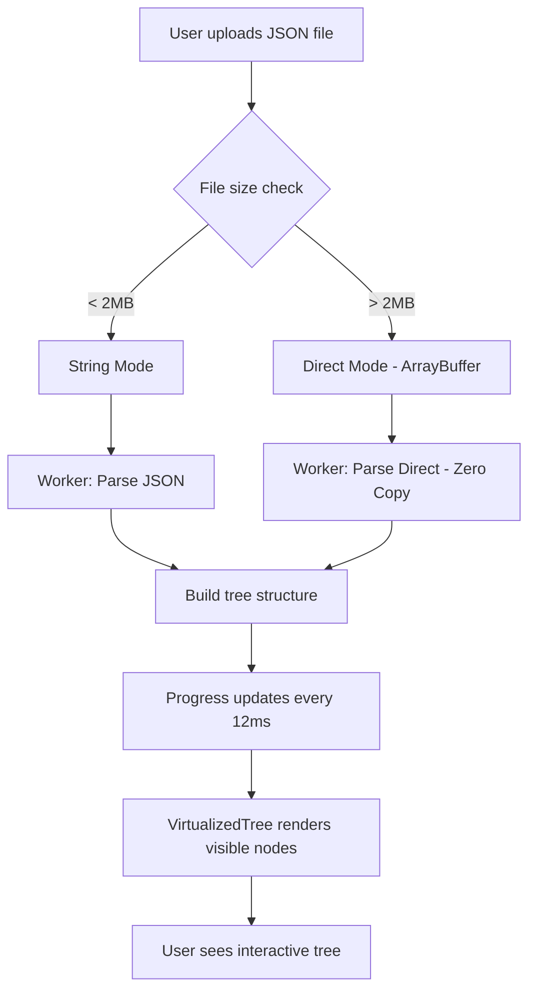

# JSON Viewer Architecture

## Overview

The JSON Viewer is DevDesk's flagship feature, designed to handle massive JSON files (100MB+) without freezing the browser. It achieves this through a combination of Web Workers, virtualized rendering, and smart memory management.

## Key Components

### 1. **JsonViewer.tsx** - Main UI Component

**Location:** `src/features/json-viewer/JsonViewer.tsx`

**Responsibilities:**
- File upload handling
- Trigger parsing operations
- Manage search functionality
- Display errors and progress

**State Management:**
Uses the global `useAppStore()` hook to access and update `jsonViewer` state slice.

### 2. **jsonParser.worker.ts** - Background Parser

**Location:** `src/workers/jsonParser.worker.ts`

**Key Innovation:** Yielding Parser
- Pauses every 12ms to let the UI thread breathe
- Prevents "long task" warnings in browser performance tools
- Maintains 60 FPS during parsing

**Message Types:**
- `PARSE_JSON` - Standard parsing for files < 2MB
- `PARSE_JSON_DIRECT` - Zero-copy parsing for large files
- `SEARCH_JSON` - Tree search with match counting

### 3. **VirtualizedJsonTree.tsx** - Tree Renderer

**Location:** `src/components/VirtualizedJsonTree.tsx`

**Performance Features:**
- Only renders visible nodes (virtualization)
- Circuit breaker at 15,000 nodes to prevent crashes
- Paginated children for large arrays (200 per page)

## Data Flow



## Performance Optimizations

### 1. **Zero-Copy Transfer (Direct Mode)**

For files > 2MB:
```typescript
const buffer = await file.arrayBuffer();
const result = await worker.postMessage(
  'PARSE_JSON_DIRECT',
  buffer,
  [buffer]  // Transfer ownership - no memory clone!
);
```

**Why it matters:**
- Copying a 50MB file would create a 100MB memory spike
- Transferring ownership keeps memory usage flat

### 2. **Yielding Parser**

```typescript
// Inside worker
for (let i = 0; i < nodes.length; i++) {
  processNode(nodes[i]);
  
  if (Date.now() - lastYield > 12) {  // Yield every 12ms
    await new Promise(resolve => setTimeout(resolve, 0));
    lastYield = Date.now();
  }
}
```

**Why 12ms?**
- 60 FPS = 16ms per frame
- Leaving 4ms buffer for browser rendering

### 3. **Circuit Breaker**

```typescript
if (expandedPaths.size >= MAX_TREE_NODES) {
  throw new Error('Tree too large - would crash browser');
}
```

**Prevents:**
- Browser tab crashes from million-node trees
- Unresponsive UI during expansion

## Search Architecture

### Real-time Search with Debouncing

```typescript
const handleSearch = useCallback(
  (query: string) => {
    worker.postMessage(
      'SEARCH_JSON',
      { tree, query },
      undefined,
      300  // 300ms debounce
    );
  },
  [tree]
);
```

**Search Features:**
- Case-insensitive matching
- Returns match count + expanded paths
- Highlights matching nodes in tree

## State Management

### JsonViewerState

```typescript
interface JsonViewerState {
  jsonInput: string;        // Raw input
  jsonTree: JsonNode | null; // Parsed tree
  fileInfo: { name, size } | null;
  isDirectMode: boolean;    // ArrayBuffer transfer mode
  rawFile: File | null;     // For Direct Mode
  error: ParseError | null;
}
```

### Update Pattern

```typescript
const { state, setJsonViewer } = useAppStore();

// Partial updates only
setJsonViewer({ error: null, jsonTree: parsedTree });
```

## Error Handling

### Common Error Scenarios

1. **Invalid JSON**
   - Shows line number if available
   - Displays clear error message

2. **Memory Exhaustion**
   - Circuit breaker prevents crashes
   - Suggests using smaller dataset

3. **Worker Crash**
   - Graceful fallback with error message
   - Worker auto-restarts on next parse

## Future Enhancements

- [ ] Lazy loading for deeply nested objects
- [ ] Infinite scroll for arrays > 10,000 items
- [ ] Export search results to CSV
- [ ] Syntax highlighting for string values

## For Developers

### Adding a New Feature

1. **Add worker message type** in `src/types/worker.ts`
2. **Handle in worker** at `src/workers/jsonParser.worker.ts`
3. **Call from UI** in `JsonViewer.tsx`
4. **Update state** via `setJsonViewer()`

### Debugging Tips

Enable performance markers:
```typescript
const measure = perfMark('parseJSON');
// ... operation
measure.end(); // Logs: "parseJSON took 245ms"
```

### Testing Large Files

```bash
# Generate 100MB JSON for testing
node scripts/generate-large-json.js
```
